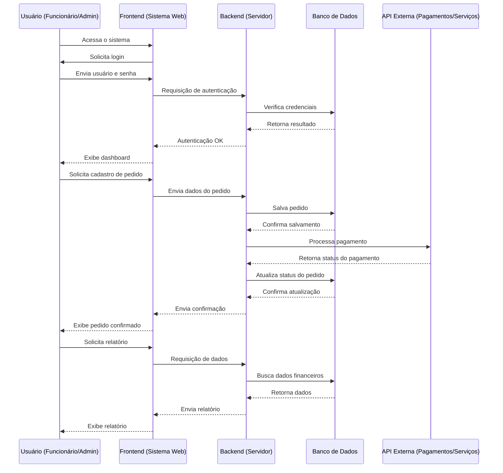

# 📊Sistema-Gestão-Empresarial
## Resumo:
Sistema web para gestão de vendas, estoque e clientes, desenvolvido como projeto integrador do curso de Análise e Desenvolvimento de Sistemas.

### 🎯 Finalidade do Projeto
Este projeto tem como objetivo desenvolver um sistema de gestão empresarial (ERP) capaz de centralizar e otimizar os principais processos administrativos de uma empresa. A plataforma permite o controle integrado de pedidos, clientes, pagamentos e relatórios, proporcionando mais eficiência, organização e tomada de decisão baseada em dados.

A proposta é oferecer uma solução prática e acessível para digitalizar operações que muitas vezes ainda são feitas de forma manual ou descentralizada.

---

### 👥 Público-Alvo
O sistema é voltado para:

- 🏬 Pequenas e médias empresas (PMEs)  
- 👨‍💼 Empreendedores e gestores  
- 🧾 Setores administrativos e financeiros  
- 📦 Negócios que precisam gerenciar pedidos e operações  

---

### 🚀 Principais Benefícios
- Centralização das informações em um único sistema  
- Redução de erros operacionais  
- Automatização de processos (pedidos, pagamentos, relatórios)  
- Melhor controle financeiro e administrativo  
- Apoio na tomada de decisões estratégicas  

---

### 💡 Visão Geral
A plataforma foi pensada para ser intuitiva, eficiente e escalável, podendo ser adaptada para diferentes tipos de negócio. Além disso, busca aplicar boas práticas de desenvolvimento, organização de código e arquitetura de sistemas, servindo também como projeto de aprendizado e portfólio.

## Infraestrutura Técnica

### 🖥️ Backend

### 🌐 Frontend Web

### 📱 Mobile

### 🗄️ Banco de Dados

## Diagrama de Sequência 

## Link
[Diagrama de Estado](https://raw.githubusercontent.com/LeonardoMartins08/sistema-gestao-empresarial/refs/heads/main/Engenharia%20de%20Software/diagrama-estado.md)

[Diagrama de sequência](https://raw.githubusercontent.com/LeonardoMartins08/sistema-gestao-empresarial/refs/heads/main/Engenharia%20de%20Software/Diagrama%20de%20Sequ%C3%AAncia.png)

[Caso de uso](github.com/LeonardoMartins08/sistema-gestao-empresarial/blob/main/Engenharia%20de%20Software/Caso%20de%20Uso.png?raw=true)

[Figma](https://www.figma.com/make/uHUuGhyVEp9BeUHooPYxQl/Loja-com-estoque-e-faturamento?p=f&t=ASkgMtrTasQzfoQn-0&fullscreen=1)

## 📌 Integrantes:

- Leonardo Martins
- Enzo Longo Bardo
- Mateus De Freitas Martis
- Diego Favini Giacomo

